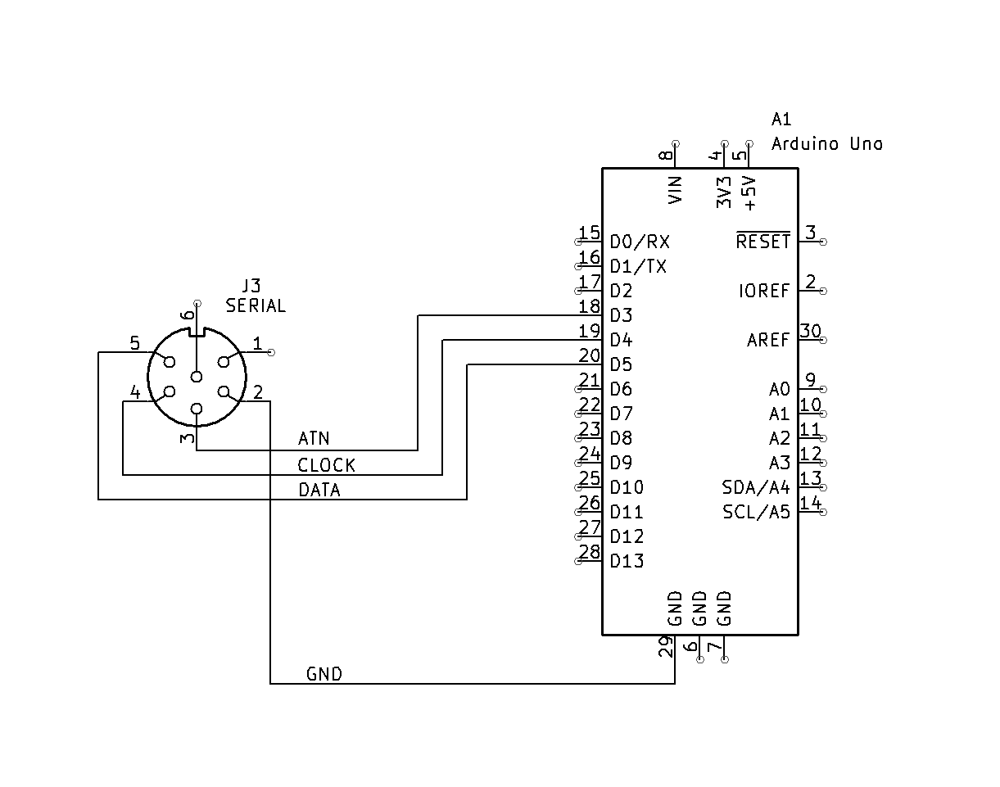
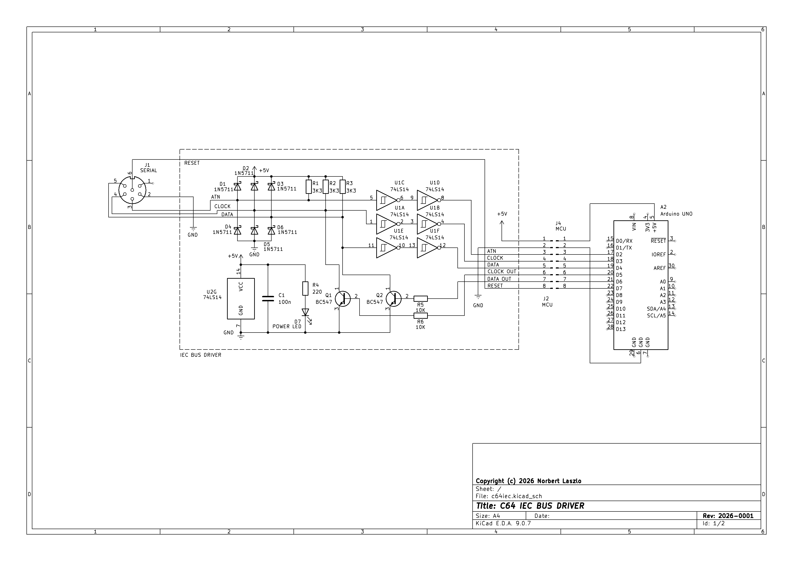
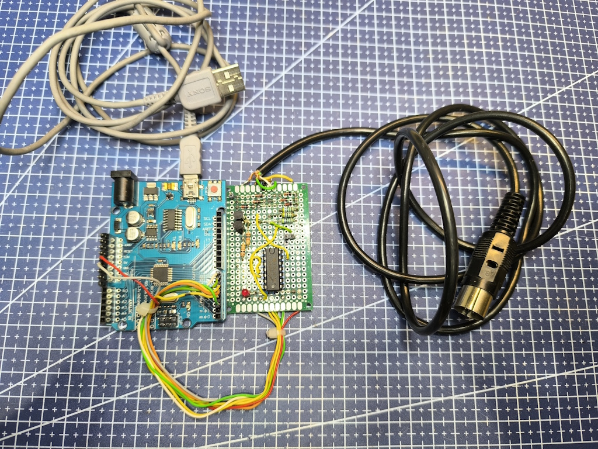
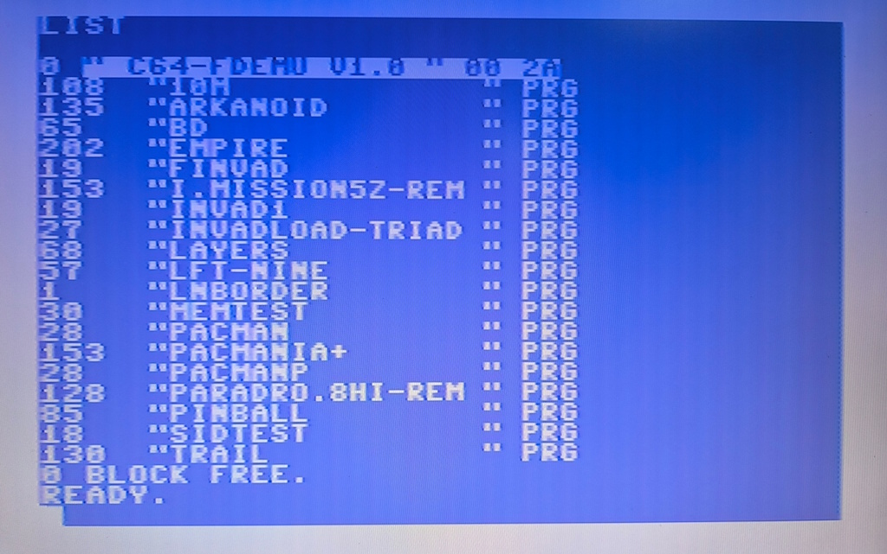
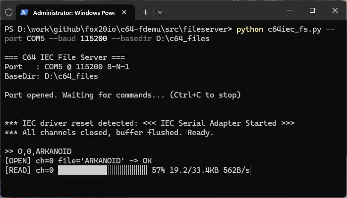

# C64-FDEMU

**C64-FDEMU** is a simple Commodore 64 floppy drive emulator that replaces a real 1541 disk drive using an Arduino Uno and a PC. It provides a straightforward way to load PRG files onto the Commodore 64 or save files directly to the PC.

The idea is to connect the C64 to the PC via its IEC serial port, using the Arduino Uno as a USB adapter. The goal is to enable the Commodore to use CBM DOS commands to browse and load program files directly from the PC with minimal effort - files that can be downloaded from various sources on the Internet.

### How does it work?

1. Create a directory on your PC.
2. Copy your C64 PRGs into this directory.
3. Start the appropriate **c64iec_fs** script on the PC.
4. Connect the C64 to the PC using the adapter.
5. Load and run the desired PRG on the C64.
6. The SAVE command can also be used to save files to the PC.

### Examples
```
LOAD"$",9
LOAD"$:0",9
LOAD"$:1",9
LOAD"*",9,1
LOAD"PACMAN",8,1
SAVE"MYPRG",9
```

### Limitations
- Maximum 144 .prg files are supported in a directory.
- Multi-load is not supported.
- Fast loading is not supported.
- CBM DOS wildcards are not fully supported.
- The maximum file name length is 16. Longer file names are automatically truncated by the server.
- The server handles only .prg files. Disk image formats such as .d64 are not supported. You must use an external tool (e.g. DirMaster) to extract .prg files from disk images.
- Keep in mind that the Commodore 64 LIST command can display only the last 22 PRG files on the screen, even if the LOAD"$" command returns more entries.

### Additional Features
- The IEC device ID can be configured from the PC side.
- The file server can automatically reconnect to the adapter if the connection is interrupted - for example, if the user disconnects the USB cable or the PC enters sleep mode.

## IEC-to-USB Adapter

The Arduino Uno must be connected to the Commodore 64 IEC bus connector using a 6-pin DIN plug. There are two ways to do this. Both require the 6-pin DIN connector, 4 or 5-core cable, and a male pin header. The firmware must also be configured correctly according to the selected wiring mode.

> **Note**: The adapter firmware is based on the <a href="https://github.com/dhansel/IECDevice">IECDevice</a> library.

> **Note**: The firmware project is based on PlatformIO. Building the project requires Visual Studio Code and the <a href="https://platformio.org">PlatformIO</a> extension. 

> **Note**: The Arduino Nano can also be used as the basis for the adapter. However, it requires a different wiring setup and firmware configuration. This project has not been tested with the Arduino Nano.


### Configuration

All configuration settings can be found in the following source files:
- /lib/IECDevice-main/IECConfig.h
- /include/IECSerialAdapterConfig.h

| Constant | Default value | Description |
|---|---|---|
| IEC_USE_LINE_DRIVERS | defined | Comment out this line if you are using the direct wiring scheme. |
| IEC_DEVICE_ID | 9 | The default Device ID used by the C64 to access this device. The default device ID of the 1541 floppy disk drive is 8. The file server can override this number. |
| SERIAL_BAUD_RATE | 115200 | Baud rate of the UART connection between the Arduino and the PC. |
| CHUNK_SIZE | 128 | Maximum communication buffer size between the adapter and the PC. The default value is optimized for the Arduino Uno. Larger values may slow down the Arduino. |
| ADAPTER_PIN_ATN | 2 | Arduino pin number connected to the ATN bus line. |
| ADAPTER_PIN_CLK_IN | 3 | Arduino pin number connected to the CLK bus line.  This pin must support interrupts. |
| ADAPTER_PIN_CLK_OUT | 5 | Arduino pin number controlling the CLK output open-collector transistor. Required only if IEC_USE_LINE_DRIVERS is defined. |
| ADAPTER_PIN_DATA_IN | 4 | Arduino pin number connected to the DATA bus line. |
| ADAPTER_PIN_DATA_OUT | 6 | Arduino pin number controlling the DATA output open-collector transistor. Required only if IEC_USE_LINE_DRIVERS is defined. |
| ADAPTER_PIN_RESET | 7 | Arduino pin number controlling the RESET line. |

### 1. Direct Wiring Scheme
The simplest way to connect the Commodore 64 to the Arduino Uno requires only four wires: ATN, CLK, DATA, and GND. Disable IEC_USE_LINE_DRIVERS in the configuration if you want to use this wiring scheme. Recommended configuration:

```
// IEC_USE_LINE_DRIVERS - undefine or comment out

#define ADAPTER_PIN_ATN  3
#define ADAPTER_PIN_CLK  4
#define ADAPTER_PIN_DATA 5
```



### 2. Line Driver Interface

For a more reliable implementation, a **bus driver** circuit can be built and placed between the Commodore 64 and the Arduino Uno. This additional circuitry can help protect both devices and prevent signal integrity issues on the data lines. However, it requires additional effort and time to implement.

Use the default configuration when using this setup.




## File Server

There are two ways to run a file server on your PC that can share a directory as a CBM DOS-compatible file system. The COM port, UART baud rate, program file directory, and the device ID used by the Commodore 64 to access the file server must be provided as parameters to the scripts.

### PowerShell

You can run the **c64iec_fs.ps1** script on Windows systems to start a file server that shares a directory on the PC with the connected Commodore 64.

The COM port name can be determined as follows:
- Connect the Arduino Uno to the PC.
- Press **Win+X** then start **Device Manager**.
- Expand the **Ports (COM & LPT)** section and locate the COM port assigned to the Arduino device.

```
Win+R -> run
wt -d "{your-download-folder}\c64-fdemu\src\fileserver" powershell

# This command enables the execution of the following server script
Set-ExecutionPolicy -Scope CurrentUser -ExecutionPolicy RemoteSigned

# COM5 is the COM port assigned to the Arduino Uno. It may be different on your PC
.\c64iec_fs.ps1 -PortName COM5 -BaseDir "D:\c64_files"
```

If you want to use a device ID other than the default one used by FDEMU, run the script with the **DeviceID** parameter:
```
.\c64iec_fs.ps1 -PortName COM5 -BaseDir "D:\c64_files" -DeviceID 8
```

### Python

You can run the **c64iec_fs.py** script on Windows or Linux systems to make a file server that can be used to share the file system directory on the PC with the connected Commodore 64.

> **Note**: Python must be installed on the target system. The script was tested with Python 3.14.4.

The script also needs the **pyserial** package to be installed:
```
pip install pyserial
```

Use the following script to find the port name on Linux systems:
```
ls -l /dev/ttyACM* /dev/ttyUSB* 2>/dev/null
```

Run the file server using one of the following commands:

```
# Windows:
python c64iec_fs.py --port COM5 --baud 115200 --basedir D:\c64_files

# Linux:
python c64iec_fs.py --port /dev/ttyUSB0 --basedir /home/user/c64_files
```

If you want to use a device ID other than the default one used by FDEMU, run the script with the **devid** parameter:
```
python c64iec_fs.py --port /dev/ttyUSB0 --basedir /home/user/c64_files --devid 8
```


# Gallery



